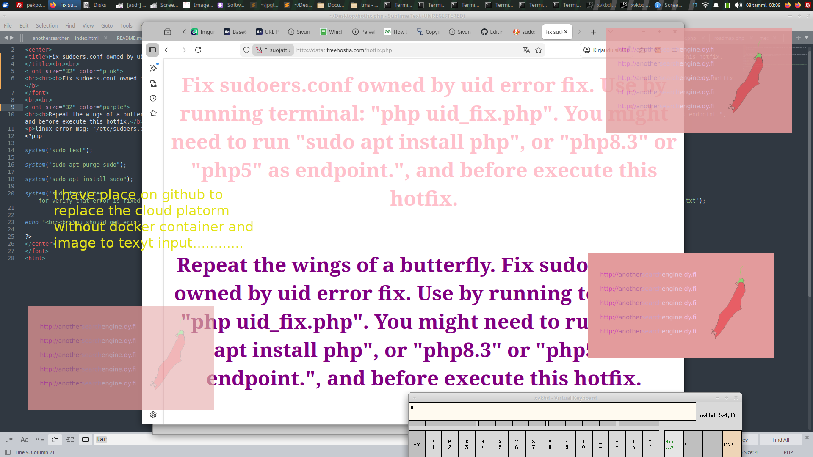
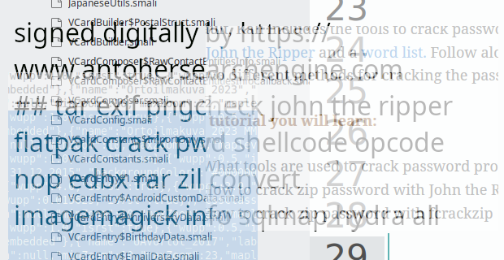

# Manual-of-README.md-file-to-enable-links-workflow-using-html-encoding-just-for-gags-and-testing-al
README.md

Before the picture i add the normal link which is:

https://datat.freehostia.com/defaultpage/nginx_default_page_modded.html

https://datat.freehostia.com/defaultpage/nginx_default_page_modded.html

https://datat.freehostia.com/defaultpage/nginx_default_page_modded.html

Adding here something else that lorem ipsum had to has the mission elsewhere. Picture base64 encoded metadata is: set_me_default_page_to..

https://datat.freehostia.com/ddossaus/

https://datat.freehostia.com/hotlinked_search/search.php

https://datat.freehostia.com/anti-ddos-protection/

http://anothersearchengine.dy.fi/
http://www.anothersearchengine.dy.fi/

http://searchengine.dy.fi/

https://datat.freehostia.com/defaultpage/

Mission impossible.

Cat tools edible oil hash function not ready.

Enter the url after this mirror:

